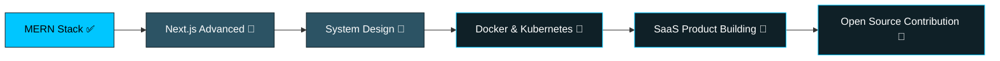

<div align="center">


<br/>

<a href="https://git.io/typing-svg">
  
```
``{=html}
```{=html}
</p>
```
```{=html}
<h3 align="center">
```
💻 Full Stack Developer \| MERN Stack Developer \| Next.js Enthusiast
```{=html}
</h3>
```
```{=html}
<p align="center">
```
Building modern, scalable and user-focused web applications.
```{=html}
</p>
```
## 🚀 About Me

-   🌱 Learning **Advanced Next.js**, **Better Auth**, **System Design**
-   💼 Passionate about building full-stack applications
-   🎯 Clean code, performance and great UI/UX
-   📍 Bangladesh

## 🛠 Tech Stack

### Frontend


### Backend


### Database


### Tools


## 🌐 Connect

-   📧 imranalfarabidevworks@gmail.com
-   💼 https://www.linkedin.com/in/imran-al-farabi-6868f
-   🌍 https://alfarabi-portfolio-vert-phi.vercel.app/
-   🐙 https://github.com/imranalfarabidevworks

## 📊 GitHub Stats


## 📈 Contribution Graph


## 🏆 GitHub Trophies


## 🚀 Featured Projects

-   Portfolio Website
-   Tourism Website
-   E-commerce Platform

## 🎯 Goals

-   Master Next.js
-   Learn Docker & Kubernetes
-   Build SaaS products
-   Contribute to Open Source

------------------------------------------------------------------------

⭐ Thanks for visiting my profile!
font=Fira+Code&weight=600&size=26&duration=3000&pause=800&color=00C6FF&center=true&vCenter=true&multiline=true&repeat=true&width=650&height=90&lines=Full+Stack+Developer+%F0%9F%92%BB;MERN+Stack+Developer+%E2%9A%99%EF%B8%8F;Next.js+Enthusiast+%F0%9F%9A%80;Clean+Code+%7C+Great+UI%2FUX+%E2%9C%A8" alt="Typing SVG" />
</a>

<br/><br/>


</div>

<br/>

## 🧑‍💻 About Me

```yaml
name: "Imran Al Farabi"
role: "Full Stack Developer (MERN | Next.js)"
location: "Bangladesh 🇧🇩"
currently_learning: ["Advanced Next.js", "Better Auth", "System Design"]
focus: ["Clean Code", "Performance", "Great UI/UX"]
passion: "Building modern, scalable & user-focused web applications 🚀"
```

- 🌱 Learning **Advanced Next.js**, **Better Auth**, **System Design**
- 💼 Passionate about building full-stack applications
- 🎯 Obsessed with clean code, performance & great UI/UX
- 📍 Based in **Bangladesh**
- ⚡ Fun fact: I debug faster with coffee ☕

<br/>

## 🛠️ Tech Stack

<div align="center">

**Frontend**
<br/>


<br/><br/>

**Backend**
<br/>


<br/><br/>

**Database**
<br/>


<br/><br/>

**Tools & Platforms**
<br/>


</div>

<br/>

## 📊 GitHub Analytics

<div align="center">


<br/>


</div>

<br/>

## 📈 Contribution Graph

<div align="center">


</div>

<br/>

## 🐍 Contribution Snake

<div align="center">


<sub>⚙️ Powered by <a href="https://github.com/Platane/snk">Platane/snk</a> — add the GitHub Action to auto-generate this snake.</sub>

</div>

<br/>

## ⏱️ WakaTime Coding Stats

<div align="center">

<!--START_SECTION:waka-->
```text
Add your WakaTime badge below by connecting https://wakatime.com/ 
and using README-stats sync, e.g:
```

<!--END_SECTION:waka-->

</div>

<br/>

## 🏆 GitHub Trophies

<div align="center">


</div>

<br/>

## 💼 Featured Projects

<div align="center">

<a href="https://alfarabi-portfolio-vert-phi.vercel.app/">

</a>
<a href="https://github.com/imranalfarabidevworks">

</a>
<br/>
<a href="https://github.com/imranalfarabidevworks">

</a>

</div>

> 💡 **Note:** Update the `repo=` values above with your exact repository names so the pinned cards render correctly.

| Project | Description | Tech Stack |
|---|---|---|
| 🌐 **Portfolio Website** | Personal portfolio showcasing my work & skills | Next.js, Tailwind CSS |
| ✈️ **Tourism Website** | Full-stack travel & tourism booking platform | MERN Stack |
| 🛒 **E-commerce Platform** | Scalable online store with cart & payments | MERN, Next.js |

<br/>

## 🎯 Current Goals

- 🚀 Master **Next.js** (App Router, Server Actions, Caching)
- 🐳 Learn **Docker & Kubernetes**
- 💡 Build **SaaS products**
- 🌍 Contribute to **Open Source**

<br/>

## 📚 Learning Roadmap



<br/>

## 🌐 Let's Connect

<div align="center">

<a href="mailto:imranalfarabidevworks@gmail.com">

</a>
<a href="https://www.linkedin.com/in/imran-al-farabi-6868f">

</a>
<a href="https://alfarabi-portfolio-vert-phi.vercel.app/">

</a>
<a href="https://github.com/imranalfarabidevworks">

</a>

</div>

<br/>

<div align="center">

### ⭐ Thanks for visiting my profile — don't forget to leave a star on repos you like!


</div>
